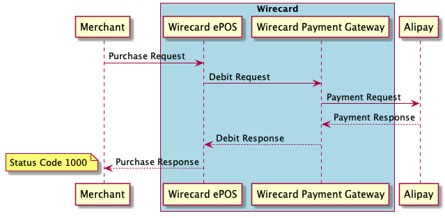
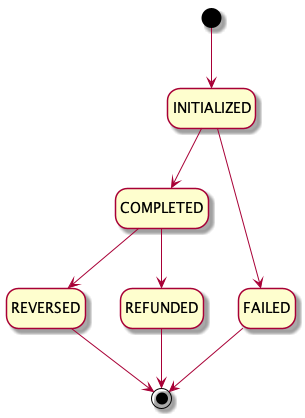

Wirecard makes it easy to accept Alipay, one of the most popular payment platforms in China. As Chinese tourism expands, accepting Alipay payments opens up fresh opportunities to increase revenues.

!!! Tip

    Visit [Wirecard website](https://www.wirecard.com/payment-base/alipay) to find out all benefits of Alipay payment.

From merchant perspective, Alipay payment is very straightforward. Only one request is needed to successfully complete Alipay payment.
    
## Workflow

!!! Note
    
    Purchase requests are serviced at following URL:
    
        https://switch.wirecard.com/mswitch-server/v1/sales

    In context of Wirecard ePOS, term `Purchase` is used for both:
    
    - type of Sale - called _Sale-Purchase_ - created by request with PURCHASE operation
    - transaction type - _cash purchase_ transaction, _card purchase_ transaction, _alipay purchase_ transaction and _wechat purchase_ transaction

## Purchase Operation

In order to process Alipay payment, make a [`POST /v1/sales`](https://switch.wirecard.com/mswitch-server/v1/sales) call:

### Request
    
    {
        "multitender": "true",
        "operation" : "PURCHASE",
        "note" : "Example Note",
        "externalId": "123456789",
        "totalAmount" : 10,
        "currencyCode" : "EUR",
        "payments" : [
            {
                "paymentMethod" : "ALIPAY",
                "transactionType" : "PURCHASE",
                "amount" : 10,
                "consumerId" : "28050011719660761"
            }
        ]
    }
    
- `"multitender"` - boolean value
    - `"TRUE"` - required
    - `"FALSE"` - deprecated
- `"operation"` - defines type of Sale request; `"PURCHASE"` operation creates Sale-Purchase record
- `"note"` - _optional field_ - used for merchant tracking purposes; it is forwarded to payment gateway in `<order-detail>` field
- `"externalId"` - _optional field_ - used for merchant tracking purposes; it is forwarded to payment gateway in `<order-number>` field
- `"totalAmount"` - defines amount of Sale-Purchase 
- `"currencyCode"` - defines currency, based on [ISO 4217](https://en.wikipedia.org/wiki/ISO_4217) standard
- `"payments"` - includes payment-specific information
    - `"paymentMethod"` - defines payment method
    - `"transactionType"` - defines type of transaction; `"PURCHASE"` transaction moves funds from end-consumer to merchant
    - `"amount"` - defines transaction amount
    - `"consumerId"` - value of scanned barcode (QR code)
    
### Response

**Status Code 1000** indicates that Alipay purchase transaction is completed successfully.

    {
        "operation": "PURCHASE",
        "timeStamp": "2019-04-12T12:27:43.069Z",
        "status": {
            "code": "1000",
            "result": "SUCCESS"
        },
        "id": "a66bbac362404fcc9c08868f881f94d9",
        "externalCashierId": null,
        "payments": [
            {
                "paymentMethod": "ALIPAY",
                "transactionType": "PURCHASE",
                "id": "a2a688bafd0e43a5965ec639daf17dc7",
                "timeStamp": "2019-04-12T12:27:42.963Z",
                "statuses": [
                    {
                        "result": "SUCCESS",
                        "code": "1000",
                        "message": "Transaction OK."
                    }
                ],
                "alipayPayTime": "20190412202742",
                "alipayTransId": "2019041220001004050261859239",
                "alipayBuyerLoginId": "int*@service.*",
                "exchangeRate": 6.9187,
                "transAmountCny": 691.87,
                "merchantName": "MA-SWITCH-01",
                "terminalId": "1234567",
                "gatewayReference": "20e66beb-b47a-4d51-9ea6-31e30ca6a040"
            }
        ],
        "externalId": "123456789",
        "merchantReceiptId": 250,
        "multitender": true
    }
    
- `"operation"` - echoed from request
- `"timeStamp"` - date-time when response was constructed
- `"status"`
    - `"code"` - `"1000"` means operation is successful
    - `"result"` - `"SUCCESS"` means operation is successful
- `"id"` - Sale-Purchase identifier assigned by Wirecard ePOS system
- `"externalCashierId"` - relevant for [Advanced Integration](advanced-overview.md); otherwise null
- `"payments"` - includes payment-specific information
    - `"paymentMethod"` - echoed from request
    - `"transactionType"` - echoed from request
    - `"id"` - identifier of transaction assigned by Wirecard ePOS system
    - `"timeStamp"` - date-time when transaction was processed
    - `"statuses"`
        - `"result"` - `"SUCCESS"` means transaction is successful
        - `"code"` - `"1000"` means transaction is successful
        - `"message"` - message provided by payment gateway
    - `"alipayPayTime"` - date-time in Alipay system
    - `"alipayTransId"` - identifier of transaction assigned by Alipay System
    - `"alipayBuyerLoginId"` - identifier of end-consumer (buyer) in Alipay system
    - `"exchangeRate"` - exchange rate between processing currency and CNY (Chinese Yuan)
    - `"transAmountCny"` - amount in CNY (Chinese Yuan)
    - `"merchantName"` - merchant name in Alipay system
    - `"terminalId"` - terminal identifier
    - `"gatewayReference"` - identifier of transaction assigned by Wirecard payment gateway
- `"externalId"` - echoed from request
- `"merchantReceiptId"` - unique identifier for merchant; it is incremented with Sale-Purchase and Sale-Return; it is advised to be printed on receipt as a barcode
- `"multitender"` - echoed from request

!!! Important
    
    After successful response, making [`GET /v1/sales/{id}`](#get-a-sale-call) call is advised, as it provides all information.

## Reverse Operation

_REVERSE_ operation is typically used in case purchase transaction was created accidentally and hence needs to be reversed.

In order to reverse Alipay purchase transaction, make a [`POST /v1/sales`](https://switch.wirecard.com/mswitch-server/v1/sales) call:

### Request

    {
        "operation": "REVERSE",
        "originalSaleId": "a66bbac362404fcc9c08868f881f94d9",
        "payments": [
            { 
                "paymentMethod": "ALIPAY",
                "transactionType": "REVERSAL",
                "originalTransactionId" : "a2a688bafd0e43a5965ec639daf17dc7"
            }
        ]
    }

- `"operation"` - defines type of Sale request
- `"originalSaleId"` - identifier of original Sale-Purchase
- `"payments"` - includes payment-specific information
    - `"paymentMethod"` - defines payment method; must be same as original payment method
    - `"transactionType"` - defines type of transaction; `"REVERSE"` operation must include `"REVERSAL"` transaction type
    - `"originalTransactionId"` - identifier of original purchase transaction
    
### Response

    {
        "operation": "REVERSE",
        "timeStamp": "2019-04-12T12:27:59.86Z",
        "status": {
            "code": "1000",
            "result": "SUCCESS"
        },
        "id": "a66bbac362404fcc9c08868f881f94d9",
        "externalCashierId": null,
        "payments": [
            {
                "paymentMethod": "ALIPAY",
                "transactionType": "REVERSAL",
                "id": "3a91fdb770004ba687c006fe2f2e122b",
                "timeStamp": "2019-04-12T12:27:59.817Z",
                "statuses": [
                    {
                        "result": "SUCCESS",
                        "code": "1000",
                        "message": "Transaction OK."
                    }
                ],
                "alipayPayTime": "20190412202742",
                "alipayTransId": "2019041220001004050261859239",
                "alipayBuyerLoginId": "int*@service.*",
                "exchangeRate": 6.9187,
                "transAmountCny": 691.87,
                "merchantName": "MA-SWITCH-01",
                "terminalId": "1234567",
                "alipayCancelTime": "20190412202759",
                "gatewayReference": "49e3a790-874f-49ed-b690-e553b59249d6"
            }
        ]
    }
    
- `"operation"` - echoed from request
- `"timeStamp"` - date-time when response was constructed
- `"status"`
    - `"code"` - `"1000"` means operation is successful
    - `"result"` - `"SUCCESS"` means operation is successful
- `"id"` - Sale-Purchase identifier assigned by Wirecard ePOS system
- `"externalCashierId"` - relevant for [Advanced Integration](advanced-overview.md); otherwise null
- `"payments"` - includes payment-specific information
    - `"paymentMethod"` - echoed from request
    - `"transactionType"` - echoed from request
    - `"id"` - identifier of reversal transaction assigned by Wirecard ePOS system
    - `"timeStamp"` - date-time when transaction was processed
    - `"statuses"`
        - `"result"` - `"SUCCESS"` means transaction is successful
        - `"code"` -  `"1000"` means transaction is successful
        - `"message"` - message provided by payment gateway
    - `"alipayPayTime"` - date-time in Alipay system
    - `"alipayTransId"` - identifier of transaction assigned by Alipay System
    - `"alipayBuyerLoginId"` - identifier of end-consumer (buyer) in Alipay system
    - `"exchangeRate"` - exchange rate between processing currency and CNY (Chinese Yuan)
    - `"transAmountCny"` - amount in CNY (Chinese Yuan)
    - `"merchantName"` - merchant name in Alipay system
    - `"terminalId"` - terminal identifier
    - `"alipayCancelTime"` - reversal date-time in Alipay system
    - `"gatewayReference"` - identifier of transaction assigned by Wirecard payment gateway

In order to explicitly [change state of Sale-Purchase to CANCELED](multi-tender.md#what-is-sale-lifecycle-model), make a  `POST /v1/sales` call with [_CANCEL_ operation](multi-tender.md#what-is-cancel-operation).

## Return Operation

_RETURN_ operation is used in case end-consumer returns merchandise and asks for a refund. Wirecard ePOS support partial as well as full return.

In order to process Alipay refund transaction, make a [`POST /v1/sales`](https://switch.wirecard.com/mswitch-server/v1/sales) call defined below:

### Request

    {
        "operation" : "RETURN",
        "totalAmount" : 100,
        "currencyCode" : "EUR",
        "originalSaleId" : "d79dc95ee0e041ed8657a763cafded51",
        "payments" : [ 
            {
                "paymentMethod" : "ALIPAY",
                "transactionType" : "REFERENCE_REFUND",
                "amount" : 100,
                "originalTransactionId" : "b1c4a37810ac43f598f29450c760b90d"
            }
        ]
    }

- `"operation"` - defines type of Sale request; `"RETURN"` operation creates new Sale-Return record
- `"totalAmount"` - defines amount to be refunded; it can be equal (full return) or less (partial return) than total amount in original Sale-Purchase
- `"currencyCode"` - must be same as for original Sale-Purchase
- `"originalSaleId"` - identifier of original Sale-Purchase
- `"payments"` - includes payment-specific information
    - `"paymentMethod"` - defines payment method
    - `"transactionType"` - defines type of transaction; must be `"REFERENCE_REFUND"` when payment method is `"ALIPAY"`
    - `"amount"` - defines amount to be refunded
    - `"originalTransactionId"` - identifier of original Alipay purchase transaction which will be refunded

### Response

    {
        "operation": "RETURN",
        "timeStamp": "2019-04-12T12:52:30.218Z",
        "status": {
            "code": "1000",
            "result": "SUCCESS"
        },
        "id": "d79dc95ee0e041ed8657a763cafded51",
        "externalCashierId": null,
        "payments": [
            {
                "paymentMethod": "ALIPAY",
                "transactionType": "REFERENCE_REFUND",
                "id": "8516d319573146a0a4853b48482ce0d5",
                "timeStamp": "2019-04-12T12:52:30.092Z",
                "statuses": [
                    {
                        "result": "SUCCESS",
                        "code": "1000",
                        "message": "Transaction OK."
                    }
                ],
                "alipayPayTime": "20190412205203",
                "alipayTransId": "2019041220001004050261859239",
                "alipayBuyerLoginId": "int*@service.*",
                "exchangeRate": 6.9187,
                "transAmountCny": 691.87,
                "merchantName": "MA-SWITCH-01",
                "terminalId": "1234567",
                "refundAmountCny": 691.87,
                "refundExchangeRate": 6.9187,
                "gatewayReference": "0f27700f-29db-4843-b73c-ffba2442e7f4"
            }
        ],
        "externalId": null,
        "merchantReceiptId": 252
    }

- `"operation"` - echoed from request
- `"timeStamp"` - date-time when response was constructed
- `"status"`
    - `"code"` - `"1000"` means operation is successful
    - `"result"` - `"SUCCESS"` means operation is successful
- `"id"` - Sale-Return identifier assigned by Wirecard ePOS system
- `"externalCashierId"` - relevant for [Advanced Integration](advanced-overview.md); otherwise null
- `"payments"` - includes payment-specific information
    - `"paymentMethod"` - echoed from request
    - `"transactionType"` - echoed from request
    - `"id"` - identifier of refund transaction assigned by Wirecard ePOS system
    - `"timeStamp"` - date-time when transaction was processed
    - `"statuses"`
        - `"result"` - `"SUCCESS"` means transaction is successful
        - `"code"` - `"1000"` means transaction is successful
        - `"message"` - message provided by payment gateway
    - `"alipayPayTime"` - date-time in Alipay system
    - `"alipayTransId"` - identifier of transaction assigned by Alipay System
    - `"alipayBuyerLoginId"` - identifier of end-consumer (buyer) in Alipay system
    - `"exchangeRate"` - exchange rate between processing currency and CNY (Chinese Yuan)
    - `"transAmountCny"` - amount in CNY (Chinese Yuan)
    - `"merchantName"` - merchant name in Alipay system
    - `"terminalId"` - terminal identifier
    - `"gatewayReference"` - identifier of transaction assigned by Wirecard payment gateway
- `"externalId"` - echoed from request
- `"merchantReceiptId"` - unique identifier for merchant; it is incremented with every Sale-Purchase and Sale-Return; it is advised to be printed on receipt as a barcode

!!! Tip
    To see all `/v1/sales` request & response examples, [click here](https://switch-test.wirecard.com/mswitch-server/doc/api-doc-sale-examples.html).
    
## Get a Sale Call

Example of `GET /v1/sales/{id}` call with excluded _merchant_ and _user_ fields (described in [Merchant Details](merchant.md) and [User Management](user.md) respectively):

    GET https://switch-test.wirecard.com/mswitch-server/v1/sales/6434f3ee5f404fec89d95c7f8538ac68?excludeField=merchant&excludeField=user
    
    {
        "id": "6434f3ee5f404fec89d95c7f8538ac68",
        "type": "PURCHASE",
        "status": "COMPLETED",
        "totalAmount": 100,
        "note": null,
        "externalId": null,
        "externalCashierId": null,
        "customerId": null,
        "initialized": "2019-04-12T13:23:48.571Z",
        "shop": null,
        "currency": {
            "number": 978,
            "code": "EUR",
            "name": "Euro",
            "minorUnit": 2
        },
        "unitPricesIncludeTax": null,
        "items": [       
        ],
        "transactions": [
            {
                "type": "ALIPAY_PURCHASE",
                "id": "587b078f93c849a2a1915c7c396cf15d",
                "status": "COMPLETED",
                "amount": 100,
                "lastUpdated": "2019-04-12T13:23:48.66Z",
                "initialized": "2019-04-12T13:23:48.573Z",
                "message": "The resource was successfully created on Alipay side.",
                "gateway": {
                    "id": "wdEeSimulated",
                    "name": "Wirecard EE Simulated",
                    "type": "WIRECARD_EE_SIMULATED",
                    "url": "http://dummy"
                },
                "gatewayReference": "f40369c5-3f88-4492-8d23-268d3c4f14dc",
                "processedByGateway": "2019-04-12T13:23:48.644Z",
                "alipayPayTime": "20190412212348",
                "alipayTransId": "2019041221001004050261859239",
                "alipayBuyerLoginId": "int*@service.*",
                "exchangeRate": 6.9187,
                "transAmountCny": 691.87,
                "merchantName": "MA-SWITCH-01",
                "terminalId": "1234567",
                "alipayConsumerAccountId": "2088122878784050",
                "autoResolveTransactions": [           
                ],
                "transactionBarcodeId": "28050011719660761"
            }
        ],
        "location": null,
        "clientInfo": null,
        "merchantReceiptId": 254,
        "cancelledBy": null,
        "shiftId": null,
        "cashRegisterId": null,
        "emailForReceiptProvided": false,
        "multitender": true
    }
    
## Purchase Transaction Lifecycle

