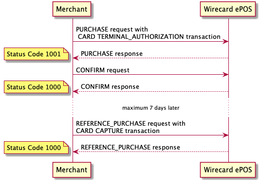
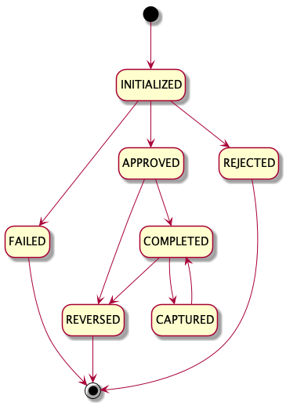
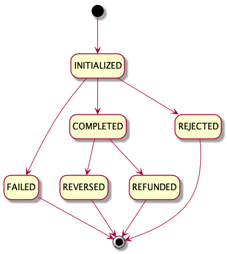

With **Terminal Authorization** transaction type merchant reserves funds on cardholder's account. It is used when an order is fulfilled later. Upon goods delivery, merchant is eligible to trigger **Capture** transaction type. Merchant has maximum 7 days to conduct Capture.

## Sequence Diagram

For the sake of simplification, below diagram includes only interactions between merchant and Wirecard ePOS system.

## Purchase Operation with Authorization Transaction

In order to process Card Authorization transaction, make a [`POST /v1/sales`](https://switch.wirecard.com/mswitch-server/v1/sales) call:

### Request

    {
        "operation": "PURCHASE",
        "note": "SaleNote",
        "externalId": "123456789",
        "shopId": "be1f50a838bb415186cff21d30f6e9bb",
        "totalAmount": 10,
        "currencyCode": "EUR",
        "unitPricesIncludeTax": true,
        "items": [
            {
                "type": "PURCHASE",
                "description": "Book",
                "unitPrice": 1,
                "quantity": 10,
                "unitTax": 0,
                "itemTotal": 10
            }
        ],
        "payments": [
            {
                "paymentMethod": "CARD",
                "transactionType": "TERMINAL_AUTHORIZATION",
                "amount": 10,
                "posEntryMode": "053",
                "cardData": {
                    "pan": "476173******0010",
                    "emvData": "5F201A5649534120414351554952455220544553542F434152442032309B02E800950502800080009F1C0861303030303832329F3901739F4005E000F0A001D7187E235938FE785AF367586D6833E954FC5C75B09D8B6500EE4F07A00000000320109F0607A00000000320109F02060000000006009F03060000000000009F2608EA8CB1420DD2C9659F360200639F0902008C82025C00500D5649534120454C454354524F4E8C159F02069F03069F1A0295055F2A029A039C019F37048D178A029F02069F03069F1A0295055F2A029A039C019F37049F2701808E0E00000000000000001E0302031F009F34031E03008407A00000000320109F1E0834303030313533379F100706010A03A000009F160F3130303132313131323030303336365F3401019701009F3303E0F8C89F1A0202769F3501225F2A0209789A031806209F410204159C01009F3704C2BA72719F150289999F21030939489F1101019F1210454C454354524F4E20444520564953415F30020221",
                    "track2Data": "7E235938FE785AF367586D6833E954FC5C75B09D8B6500EE",
                    "dataEncryptionParams": {
                        "encoding": "hex",
                        "format": "thor-posmate-chip",
                        "ksn": "FFFF9876543210E00187",
                        "name": "paymentengine.thor-2",
                        "padding": "pkcs",
                        "version": "0"
                    },
                    "signatureImg": "iVBORw0KGgoAAAANSUhEUgAAAMgAAABQAQMAAABmo6jzAAAABlBMVEUAAAD///+l2Z/dAAABtklEQVRIx+3UP24TQRTH8Y2QoPQFkHwMCkBzhBxhb4DLlCMk7rHHoAjKgFIjlxQEP0uRYkVWeEELjO3ZmS/F7B87ZPsoypS/T/GK9+ZXMPaKJ3ngkiZjcuvHxN8jmueMS+iDxhxK7CXIoSQADOB1VOqcVHfE4SNfEpayk0knq2TeRhyzTjyNocShLGJAkm9lEwjCMQ7hOnpWvfwNnCsnGIQ6KuH29bwXpykLsSI8P23lZ8Bq9K1Ymub7gYQsW0sT160sGqyGiKGCHaT6dydYq+cRg4MtNLo9znKBtepSlgA7SZMsP7BWHbbEwjO4klRmWeOsOtwssSlOQErKbqfOqWPxrsAzBzHp5dG+XN2AIiAmvY/tvblKHZs1CALikulF5w5WIFQgjmoQMaAgyYCAdCLqLFzm5FD8mYWvg2gv4QxYgIQs9SCfALGIBz6/4HKQ0z0h7MvHVjTLt/SfLIvCEHCDvGoFEAJ2kFkWBSpC0/9T2WkWD1hCGGQ7zxJgaYl+kF8mS4QJRO1l+oEsiQZI0klavmmF4ghg2kmUXSd3OmQz/QNwYe9plxrghjG5Hm2k+qmVH7v8A84wa2czimIhAAAAAElFTkSuQmCC"
                },
                "terminal": {
                    "serialNo": "40090041",
                    "terminalType": {
                        "model": "SPm2",
                        "vendor": "Spire"
                    }
                }
            }
        ],
        "multitender": true
    }
    
- `"operation"` - defines type of Sale request; `PURCHASE` operation creates Sale-Purchase record
- `"note"` - _optional field_ - used for merchant tracking purposes
- `"externalId"` - _optional field_ - used for merchant tracking purposes
- `"shopId"` - _optional field_ - reference to merchant's shop registered in Wirecard ePOS system, see more details in [Shop Management](shop.md)
- `"totalAmount"` - defines amount of Sale-Purchase 
- `"currencyCode"` - defines currency, based on [ISO 4217](https://en.wikipedia.org/wiki/ISO_4217) standard
- `"unitPricesIncludeTax"` - _conditional field_ - see mode details in [Sale Items](items.md)
- `"items"` - _conditional field_ - see mode details in [Sale Items](items.md)
- `"payments"` - includes payment-specific information
    - `"paymentMethod"` - defines payment method
    - `"transactionType"` - defines type of transaction; `TERMINAL_AUTHORIZATION` transaction reserves funds from the cardholder's account
    - `"amount"` - defines transaction amount
    - `"posEntryMode"` - defines POS entry mode, see [ISO 8583](https://en.wikipedia.org/wiki/ISO_8583#Point_of_service_entry_modes)
    - `"cardData"` - includes card transaction data, see more details in [Notes to mPOS Card payment method](https://switch-test.wirecard.com/mswitch-server/doc/api-doc-sale.html#_mpos_card_payment_methods)
    - `"terminal"` - includes terminal-specific information
        - `"terminalType"` - includes vendor and model
        - `"serialNo"` - defines terminal serial number
- `"multitender"` - boolean value
    - `"TRUE"` - required
    - `"FALSE"` - deprecated

### Response

    {
        "operation": "PURCHASE",
        "timeStamp": "2019-08-28T09:40:51.599Z",
        "status": {
            "code": "1001",
            "result": "SUCCESS"
        },
        "id": "f7a82ab377df401da1e301eccc4cc6e8",
        "externalCashierId": null,
        "payments": [
            {
                "paymentMethod": "CARD",
                "transactionType": "TERMINAL_AUTHORIZATION",
                "id": "9c88eb4426494917909cbe574f5b8d00",
                "timeStamp": "2019-08-28T09:40:51.563Z",
                "statuses": [
                    {
                        "result": "SUCCESS",
                        "code": "1001",
                        "message": "Transaction OK."
                    }
                ],
                "authorizationCode": "629886",
                "terminalId": "a1234567",
                "cardData": {
                    "token": "N/A",
                    "maskedPAN": "476173______0010",
                    "cardBrand": "VISA",
                    "emvData": "910A50FD39923A5C794F00128A023030",
                    "aid": "A0000000032010",
                    "applicationLabel": "VISA ELECTRON",
                    "cardHolderName": "VISA ACQUIRER TEST/CARD 20"
                }
            }
        ],
        "externalId": "123456789",
        "merchantReceiptId": 340,
        "multitender": true
    }

- `"operation"` - echoed from request
- `"timeStamp"` - date-time when response was constructed
- `"status"`
    - `"code"` - `"1001"` means operation is successful, however follow-up `CONFIRM` request is required to complete Card Authorization transaction  
    - `"result"` - `"SUCCESS"` means operation is successful
- `"id"` - Sale-Purchase identifier assigned by Wirecard ePOS system
- `"externalCashierId"` - relevant for [Advanced Integration](advanced-overview.md); otherwise null
- `"payments"` - includes payment-specific information
    - `"paymentMethod"` - echoed from request
    - `"transactionType"` - echoed from request
    - `"id"` - identifier of transaction assigned by Wirecard ePOS system
    - `"timeStamp"` - date-time when transaction was processed
    - `"statuses"`
        - `"result"` - `"SUCCESS"` means transaction is successful
        - `"code"` - `"1001"` means transaction is successful
        - `"message"` - message provided by payment gateway
    - `"authorizationCode"` - authorization code provided by scheme
    - `"terminalId"` - TID used for this purchase transaction
    - `"cardData"` - includes card transaction data, see more details in [Notes to mPOS Card payment method](https://switch-test.wirecard.com/mswitch-server/doc/api-doc-sale.html#_mpos_card_payment_methods)
- `"externalId"` - echoed from request
- `"merchantReceiptId"` - unique identifier for merchant; it is incremented with Sale-Purchase and Sale-Return; it is advised to be printed on receipt as a barcode
- `"multitender"` - echoed from request

## Confirm Operation

### Request

    {
        "operation": "CONFIRM",
        "originalSaleId": "f7a82ab377df401da1e301eccc4cc6e8",
        "payments": [
            {
                "paymentMethod": "CARD",
                "transactionType": "CONFIRM",
                "terminal": {
                    "terminalType": {
                        "model": "SPm2",
                        "vendor": "Spire"
                    },
                    "serialNo": "40090041"
                },
                "cardData": {
                    "emvData": "9F26081206DDBC6D8008289F2701409F360200639F3704C2BA7271950502800080009B02F8009F34031E0300"
                }
            }
        ]
    }

- `"operation"` - defines type of Sale request; `CONFIRM` operation does finish the Card Authorization transaction whereas `DECLINE` reverses the Card Authorization transaction
- `"originalSaleId"` - identifier of original Sale-Purchase
- `"payments"` - includes payment-specific information
    - `"paymentMethod"` - defines payment method; it must be same as original payment transaction
    - `"transactionType"` - defines type of transaction; `CONFIRM` operation must include `CONFIRM` transaction type, `DECLINE` operation must include `DECLINE` transaction type
    - `"terminal"` - includes terminal-specific information
        - `"terminalType"` - includes vendor and model
        - `"serialNo"` - defines terminal serial number
    - `"cardData"` - includes additional card transaction data
        - `"emvData"` - mandatory for EMV transaction
        - `"signatureImg"` - _optional field_ - provided as PNG formatted to Base64 string
        
### Response

    {
        "operation": "CONFIRM",
        "timeStamp": "2019-08-28T09:40:55.739Z",
        "status": {
            "code": "1000",
            "result": "SUCCESS"
        },
        "id": "f7a82ab377df401da1e301eccc4cc6e8",
        "externalCashierId": null,
        "payments": [
            {
                "paymentMethod": "CARD",
                "transactionType": "CONFIRM",
                "id": "9c88eb4426494917909cbe574f5b8d00",
                "timeStamp": "2019-08-28T09:40:55.717Z",
                "statuses": [
                    {
                        "result": "SUCCESS",
                        "code": "1000",
                        "message": "Transaction OK."
                    }
                ],
                "authorizationCode": ""
            }
        ]
    }

- `"operation"` - echoed from request
- `"timeStamp"` - date-time when response was constructed
- `"status"`
    - `"code"` - `"1000"` means operation is successful
    - `"result"` - `"SUCCESS"` means operation is successful
- `"id"` - Sale-Purchase identifier assigned by Wirecard ePOS system
- `"externalCashierId"` - relevant for [Advanced Integration](advanced-overview.md); otherwise null
- `"payments"` - specific information for every payment method
    - `"paymentMethod"` - echoed from request
    - `"transactionType"` - echoed from request
    - `"id"` - identifier of purchase transaction assigned by Wirecard ePOS system; in case of `CONFIRM` it represents identifier of confirmed Card Purchase transaction (so it’s the same as returned in the response during the 1st step), in case of `DECLINE` it represents identifier of Card Reversal transaction (newly) created by system to execute `DECLINE` operation
    - `"timeStamp"` - date-time when transaction was processed by payment gateway
    - `"statuses"`
        - `"result"` - `"SUCCESS"` means transaction is successful
        - `"code"` - `"1000"` means transaction is successful
        - `"message"` - message provided by payment gateway
    - `"authorizationCode"` - authorization code provided by scheme

!!! Important
    
    After successful response, making [`GET /v1/sales/{id}`](#get-a-sale-call) call is advised, as it provides all information.
    
## Reference Purchase Operation with Capture Transaction

### Request

    {
        "operation": "REFERENCE_PURCHASE",
        "originalSaleId": "f7a82ab377df401da1e301eccc4cc6e8",
        "payments": [
            {
                "paymentMethod": "CARD",
                "transactionType": "CAPTURE",
                "amount": 10,
                "originalTransactionId": "9c88eb4426494917909cbe574f5b8d00"
            }
        ]
    }

- `"operation"` - defines type of Sale request; `REFERENCE_PURCHASE` operation
- `"originalSaleId"` - identifier of original Sale-Purchase
- `"payments"` - includes payment-specific information
    - `"paymentMethod"` - defines payment method; it must be same as original payment transaction
    - `"transactionType"` - defines type of transaction; `CAPTURE` transaction type
    - `"amount"` - defines type of transaction; `CAPTURE` transaction type
    - `"originalTransactionId"` - defines type of transaction; `CAPTURE` transaction type

### Response
    
    {
        "operation": "REFERENCE_PURCHASE",
        "timeStamp": "2019-08-28T11:02:39.117Z",
        "status": {
            "code": "1000",
            "result": "SUCCESS"
        },
        "id": "f7a82ab377df401da1e301eccc4cc6e8",
        "externalCashierId": null,
        "payments": [
            {
                "paymentMethod": "CARD",
                "transactionType": "CAPTURE",
                "id": "d608a177282e4d27b59f329594823271",
                "timeStamp": "2019-08-28T11:02:38.957Z",
                "statuses": [
                    {
                        "result": "SUCCESS",
                        "code": "1000",
                        "message": "Transaction OK."
                    }
                ],
                "authorizationCode": "629886"
            }
        ],
        "multitender": true
    }
    
## Get a Sale Call

Example of `GET /v1/sales/{id}` call with excluded _merchant_, _user_ and _shop_ fields (described in [Merchant Details](merchant.md), [User Management](user.md) and [Shop Management](shop.md) respectively):

    GET https://switch-test.wirecard.com/mswitch-server/v1/sales/f7a82ab377df401da1e301eccc4cc6e8?excludeField=merchant&excludeField=user&excludeField=shop
    
    {
        "id": "f7a82ab377df401da1e301eccc4cc6e8",
        "type": "PURCHASE",
        "status": "COMPLETED",
        "totalAmount": 10,
        "note": "SaleNote",
        "externalId": "123456789",
        "externalCashierId": null,
        "customerId": null,
        "initialized": "2019-08-28T09:40:51.404Z",
        "currency": {
            "number": 978,
            "code": "EUR",
            "name": "Euro",
            "minorUnit": 2
        },
        "unitPricesIncludeTax": true,
        "items": [
            {
                "type": "PURCHASE",
                "description": "Book",
                "categoryName": null,
                "externalCategoryId": null,
                "unitPrice": 1,
                "unitPriceModified": null,
                "quantity": 10,
                "unitTax": 0,
                "itemTotal": 10,
                "externalProductId": null,
                "internalProductId": null
            }
        ],
        "transactions": [
            {
                "type": "CARD_TERMINAL_AUTHORIZATION",
                "id": "9c88eb4426494917909cbe574f5b8d00",
                "status": "CAPTURED",
                "amount": 10,
                "lastUpdated": "2019-08-28T11:02:38.976Z",
                "initialized": "2019-08-28T09:40:51.405Z",
                "message": "Transaction has been captured.\nWas: Authorization has been completed (approved by client). \nWas: Card Authorize has been approved (by the gateway).",
                "gateway": {
                    "id": "wdEeSimulated",
                    "name": "Wirecard EE Simulated",
                    "type": "WIRECARD_EE_SIMULATED",
                    "url": "http://dummy"
                },
                "gatewayReference": "f37fb71d-0bf4-4952-86a7-7221bca0ac3a",
                "processedByGateway": "2019-08-28T09:40:51.563Z",
                "authorizationCode": "629886",
                "autoResolveTransactions": [],
                "reversalTransactions": [],
                "cardHolderName": "VISA ACQUIRER TEST/CARD 20",
                "maskedCardNumber": "476173******0010",
                "cardBrand": "VISA",
                "captureTransactions": [
                    {
                        "type": "CARD_CAPTURE",
                        "id": "d608a177282e4d27b59f329594823271",
                        "status": "COMPLETED",
                        "amount": 10,
                        "lastUpdated": "2019-08-28T11:02:38.976Z",
                        "initialized": "2019-08-28T11:02:38.871Z",
                        "message": "Capture has been completed.",
                        "gateway": {
                            "id": "wdEeSimulated",
                            "name": "Wirecard EE Simulated",
                            "type": "WIRECARD_EE_SIMULATED",
                            "url": "http://dummy"
                        },
                        "gatewayReference": "11a70aa3-f980-4568-ab5a-bc4efe2a6801",
                        "processedByGateway": "2019-08-28T11:02:38.957Z",
                        "authorizationCode": "629886",
                        "autoResolveTransactions": [],
                        "reversalTransactions": [],
                        "refundTransactions": [],
                        "authorizationTransaction": {
                            "type": "TransactionRef",
                            "id": "9c88eb4426494917909cbe574f5b8d00"
                        }
                    }
                ],
                "terminal": {
                    "id": "78e6c01261ec4247835498398f96ae98",
                    "serialNo": "40090041",
                    "location": "Kosice",
                    "description": null,
                    "terminalType": {
                        "vendor": "Spire",
                        "model": "SPm2"
                    },
                    "merchant": null,
                    "status": "ENABLED",
                    "lastTimeOnline": "2019-08-28T09:40:51.364Z",
                    "currentUpdateSet": {
                        "configuration": {
                            "id": "717c604cdd1d4573ab219afc7e1e2bbd",
                            "resourceUpdateVersion": "Spm2_MC&VISA_BTT",
                            "priority": "C"
                        },
                        "application": {
                            "id": "48bdf3a76bf340408e880324fb38d4ea",
                            "resourceUpdateVersion": "t2.30.66L",
                            "priority": "A"
                        },
                        "firmware": null
                    },
                    "assignedUpdateSet": null,
                    "terminalCapabilitiesTemplate": {
                        "id": "9e88df78439d4df5b93e2c7c94afcebf",
                        "name": "Another posmate template",
                        "emvTerminalType": "22",
                        "emvTransactionCategoryCode": "R",
                        "capabilities": "E0F8C8",
                        "additionalCapabilities": "E000F0A001"
                    },
                    "aidConfigurations": null
                },
                "posEntryMode": "053",
                "tid": "a1234567",
                "mid": "87654321",
                "bdkId": "FFFF",
                "signatureImage": "iVBORw0KGgoAAAANSUhEUgAAAMgAAABQAQMAAABmo6jzAAAABlBMVEUAAAD///+l2Z/dAAABtklEQVRIx+3UP24TQRTH8Y2QoPQFkHwMCkBzhBxhb4DLlCMk7rHHoAjKgFIjlxQEP0uRYkVWeEELjO3ZmS/F7B87ZPsoypS/T/GK9+ZXMPaKJ3ngkiZjcuvHxN8jmueMS+iDxhxK7CXIoSQADOB1VOqcVHfE4SNfEpayk0knq2TeRhyzTjyNocShLGJAkm9lEwjCMQ7hOnpWvfwNnCsnGIQ6KuH29bwXpykLsSI8P23lZ8Bq9K1Ymub7gYQsW0sT160sGqyGiKGCHaT6dydYq+cRg4MtNLo9znKBtepSlgA7SZMsP7BWHbbEwjO4klRmWeOsOtwssSlOQErKbqfOqWPxrsAzBzHp5dG+XN2AIiAmvY/tvblKHZs1CALikulF5w5WIFQgjmoQMaAgyYCAdCLqLFzm5FD8mYWvg2gv4QxYgIQs9SCfALGIBz6/4HKQ0z0h7MvHVjTLt/SfLIvCEHCDvGoFEAJ2kFkWBSpC0/9T2WkWD1hCGGQ7zxJgaYl+kF8mS4QJRO1l+oEsiQZI0klavmmF4ghg2kmUXSd3OmQz/QNwYe9plxrghjG5Hm2k+qmVH7v8A84wa2czimIhAAAAAElFTkSuQmCC",
                "approvedOffline": false,
                "declinedOffline": false,
                "pinVerified": null,
                "pinVerificationMethod": null,
                "aid": "A0000000032010",
                "emvData": "5f201a5649534120414351554952455220544553542f434152442032309b02e800950502800080009f1c0861303030303832329f3901739f4005e000f0a001d7187e235938fe785af367586d6833e954fc5c75b09d8b6500ee4f07a00000000320109f0607a00000000320109f02060000000006009f03060000000000009f2608ea8cb1420dd2c9659f360200639f0902008c82025c00500d5649534120454c454354524f4e8c159f02069f03069f1a0295055f2a029a039c019f37048d178a029f02069f03069f1a0295055f2a029a039c019f37049f2701808e0e00000000000000001e0302031f009f34031e03008407a00000000320109f1e0834303030313533379f100706010a03a000009f160f3130303132313131323030303336365f3401019701009f3303e0f8c89f1a0202769f3501225f2a0209789a031806209f410204159c01009f3704c2ba72719f150289999f21030939489f1101019f1210454c454354524f4e20444520564953415f30020221",
                "emvUpdateData": "9f26081206ddbc6d8008289f2701409f360200639f3704c2ba7271950502800080009b02f8009f34031e0300",
                "applicationLabel": "VISA ELECTRON"
            },
            {
                "type": "CARD_CAPTURE",
                "id": "d608a177282e4d27b59f329594823271",
                "status": "COMPLETED",
                "amount": 10,
                "lastUpdated": "2019-08-28T11:02:38.976Z",
                "initialized": "2019-08-28T11:02:38.871Z",
                "message": "Capture has been completed.",
                "gateway": {
                    "id": "wdEeSimulated",
                    "name": "Wirecard EE Simulated",
                    "type": "WIRECARD_EE_SIMULATED",
                    "url": "http://dummy"
                },
                "gatewayReference": "11a70aa3-f980-4568-ab5a-bc4efe2a6801",
                "processedByGateway": "2019-08-28T11:02:38.957Z",
                "authorizationCode": "629886",
                "autoResolveTransactions": [],
                "reversalTransactions": [],
                "refundTransactions": [],
                "authorizationTransaction": {
                    "type": "CARD_TERMINAL_AUTHORIZATION",
                    "id": "9c88eb4426494917909cbe574f5b8d00",
                    "status": "CAPTURED",
                    "amount": 10,
                    "lastUpdated": "2019-08-28T11:02:38.976Z",
                    "initialized": "2019-08-28T09:40:51.405Z",
                    "message": "Transaction has been captured.\nWas: Authorization has been completed (approved by client). \nWas: Card Authorize has been approved (by the gateway).",
                    "gateway": {
                        "id": "wdEeSimulated",
                        "name": "Wirecard EE Simulated",
                        "type": "WIRECARD_EE_SIMULATED",
                        "url": "http://dummy"
                    },
                    "gatewayReference": "f37fb71d-0bf4-4952-86a7-7221bca0ac3a",
                    "processedByGateway": "2019-08-28T09:40:51.563Z",
                    "authorizationCode": "629886",
                    "autoResolveTransactions": [],
                    "reversalTransactions": [],
                    "cardHolderName": "VISA ACQUIRER TEST/CARD 20",
                    "maskedCardNumber": "476173******0010",
                    "cardBrand": "VISA",
                    "captureTransactions": [
                        {
                            "type": "TransactionRef",
                            "id": "d608a177282e4d27b59f329594823271"
                        }
                    ],
                    "terminal": {
                        "id": "78e6c01261ec4247835498398f96ae98",
                        "serialNo": "40090041",
                        "location": "Kosice",
                        "description": null,
                        "terminalType": {
                            "vendor": "Spire",
                            "model": "SPm2"
                        },
                        "merchant": null,
                        "status": "ENABLED",
                        "lastTimeOnline": "2019-08-28T09:40:51.364Z",
                        "currentUpdateSet": {
                            "configuration": {
                                "id": "717c604cdd1d4573ab219afc7e1e2bbd",
                                "resourceUpdateVersion": "Spm2_MC&VISA_BTT",
                                "priority": "C"
                            },
                            "application": {
                                "id": "48bdf3a76bf340408e880324fb38d4ea",
                                "resourceUpdateVersion": "t2.30.66L",
                                "priority": "A"
                            },
                            "firmware": null
                        },
                        "assignedUpdateSet": null,
                        "terminalCapabilitiesTemplate": {
                            "id": "9e88df78439d4df5b93e2c7c94afcebf",
                            "name": "Another posmate template",
                            "emvTerminalType": "22",
                            "emvTransactionCategoryCode": "R",
                            "capabilities": "E0F8C8",
                            "additionalCapabilities": "E000F0A001"
                        },
                        "aidConfigurations": null
                    },
                    "posEntryMode": "053",
                    "tid": "a1234567",
                    "mid": "87654321",
                    "bdkId": "FFFF",
                    "signatureImage": "iVBORw0KGgoAAAANSUhEUgAAAMgAAABQAQMAAABmo6jzAAAABlBMVEUAAAD///+l2Z/dAAABtklEQVRIx+3UP24TQRTH8Y2QoPQFkHwMCkBzhBxhb4DLlCMk7rHHoAjKgFIjlxQEP0uRYkVWeEELjO3ZmS/F7B87ZPsoypS/T/GK9+ZXMPaKJ3ngkiZjcuvHxN8jmueMS+iDxhxK7CXIoSQADOB1VOqcVHfE4SNfEpayk0knq2TeRhyzTjyNocShLGJAkm9lEwjCMQ7hOnpWvfwNnCsnGIQ6KuH29bwXpykLsSI8P23lZ8Bq9K1Ymub7gYQsW0sT160sGqyGiKGCHaT6dydYq+cRg4MtNLo9znKBtepSlgA7SZMsP7BWHbbEwjO4klRmWeOsOtwssSlOQErKbqfOqWPxrsAzBzHp5dG+XN2AIiAmvY/tvblKHZs1CALikulF5w5WIFQgjmoQMaAgyYCAdCLqLFzm5FD8mYWvg2gv4QxYgIQs9SCfALGIBz6/4HKQ0z0h7MvHVjTLt/SfLIvCEHCDvGoFEAJ2kFkWBSpC0/9T2WkWD1hCGGQ7zxJgaYl+kF8mS4QJRO1l+oEsiQZI0klavmmF4ghg2kmUXSd3OmQz/QNwYe9plxrghjG5Hm2k+qmVH7v8A84wa2czimIhAAAAAElFTkSuQmCC",
                    "approvedOffline": false,
                    "declinedOffline": false,
                    "pinVerified": null,
                    "pinVerificationMethod": null,
                    "aid": "A0000000032010",
                    "emvData": "5f201a5649534120414351554952455220544553542f434152442032309b02e800950502800080009f1c0861303030303832329f3901739f4005e000f0a001d7187e235938fe785af367586d6833e954fc5c75b09d8b6500ee4f07a00000000320109f0607a00000000320109f02060000000006009f03060000000000009f2608ea8cb1420dd2c9659f360200639f0902008c82025c00500d5649534120454c454354524f4e8c159f02069f03069f1a0295055f2a029a039c019f37048d178a029f02069f03069f1a0295055f2a029a039c019f37049f2701808e0e00000000000000001e0302031f009f34031e03008407a00000000320109f1e0834303030313533379f100706010a03a000009f160f3130303132313131323030303336365f3401019701009f3303e0f8c89f1a0202769f3501225f2a0209789a031806209f410204159c01009f3704c2ba72719f150289999f21030939489f1101019f1210454c454354524f4e20444520564953415f30020221",
                    "emvUpdateData": "9f26081206ddbc6d8008289f2701409f360200639f3704c2ba7271950502800080009b02f8009f34031e0300",
                    "applicationLabel": "VISA ELECTRON"
                }
            }
        ],
        "location": null,
        "clientInfo": null,
        "merchantReceiptId": 340,
        "cancelledBy": null,
        "shiftId": null,
        "cashRegisterId": null,
        "emailForReceipt": null,
        "emailForReceiptProvided": false,
        "multitender": true,
        "version": 0
    }
    
## Card Authorization Transaction Lifecycle

## Card Capture Transaction Lifecycle

