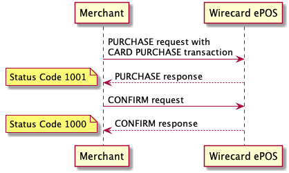
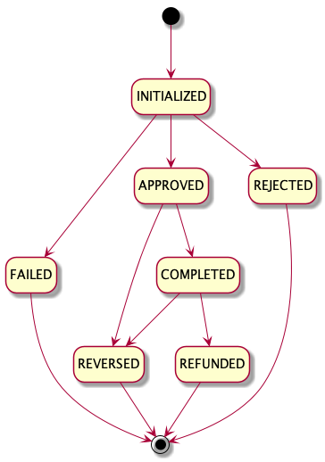

Every Purchase operation with **Card Purchase** transaction (EMV or Magstripe card payment) has to be confirmed or declined by follow-up Sale completion request, so 2 steps are needed:

- Initial Purchase request
- Completion (follow-up) request with `CONFIRM` or `DECLINE` operation

## Sequence Diagram

For the sake of simplification, below diagram includes only interactions between merchant and Wirecard ePOS system.

## Purchase Operation

In order to process Card Purchase transaction, make a [`POST /v1/sales`](https://switch.wirecard.com/mswitch-server/v1/sales) call:

### Request

    {
        "multitender": true,
        "operation": "PURCHASE",
        "note": "SaleNote",
        "externalId": "123456789",
        "shopId": "be1f50a838bb415186cff21d30f6e9bb",
        "unitPricesIncludeTax": true,
        "items": [
            {
                "type": "PURCHASE",
                "description": "Item",
                "unitPrice": 100,
                "quantity": 1,
                "unitTax": 20,
                "itemTotal": 100
            }
        ],
        "totalAmount": 100,
        "currencyCode": "EUR",
        "payments": [
            {
                "paymentMethod": "CARD",
                "transactionType": "PURCHASE",
                "amount": 100,
                "terminal": {
                    "terminalType": {
                        "model": "SPm2",
                        "vendor": "Spire"
                    },
                    "serialNo": "40090041"
                },
                "cardData": {
                    "emvData": "9B020000950580000000009F1C0834303030313534319F3901059F4005E000F0A001D718A0C0EB7A3B00F0E13B74CE39071BFD0D92909334536DD70D4F07A00000000410109F0607A00000000410109F02060000000005009F03060000000000009F26088767AB29C984EF169F360200839F0902000282025880500C4D43432034303620563120338C219F02069F03069F1A0295055F2A029A039C019F37049F35019F45029F4C089F34039F2701828E0E00000000000000005E0342031F009F34031F00028407A00000000410109F1E0834303030313534319F10120110A000002C0000000000000000000000FF9F160D53706972655061796D656E74735F3401009F3303E008C89F1A0202769F3501225F2A0209789A031805159F410210609C01009F3704A00BBB829F150289999F21031538259F6E060056010230309F1D086C7A000000000000",
                    "pan": "5413331122224062",
                    "track2Data": "A0C0EB7A3B00F0E13B74CE39071BFD0D92909334536DD70D",
                    "dataEncryptionParams": {
                        "ksn": "00000101000000800241",
                        "name": "paymentengine.thor-2",
                        "version": "0",
                        "padding": "pkcs",
                        "encoding": "hex",
                        "format": "thor-posmate-chip"
                    },
                    "pinData": "EC8CA9CF42F0F99D",
                    "pinEncryptionParams": {
                        "ksn": "00000101000000800241",
                        "name": "paymentengine.thor-2",
                        "version": "0",
                        "encoding": "hex",
                        "format": "ISO-0"
                    }
                },
                "posEntryMode": "053",
                "declinedOffline": false,
                "approvedOffline": false
            }
        ]
    }
        
- `"multitender"` - boolean value
    - `"TRUE"` - required
    - `"FALSE"` - deprecated
- `"operation"` - defines type of Sale request; `PURCHASE` operation creates Sale-Purchase record
- `"note"` - _optional field_ - used for merchant tracking purposes
- `"externalId"` - _optional field_ - used for merchant tracking purposes
- `"shopId"` - _optional field_ - reference to merchant's shop registered in Wirecard ePOS system, see more details in [Shop Management](shop.md)
- `"unitPricesIncludeTax"` - _conditional field_ - see mode details in [Sale Items](items.md)
- `"items"` - _conditional field_ - see mode details in [Sale Items](items.md)
- `"totalAmount"` - defines amount of Sale-Purchase 
- `"currencyCode"` - defines currency, based on [ISO 4217](https://en.wikipedia.org/wiki/ISO_4217) standard
- `"payments"` - includes payment-specific information
    - `"paymentMethod"` - defines payment method
    - `"transactionType"` - defines type of transaction; `PURCHASE` transaction moves funds from end-consumer to merchant
    - `"amount"` - defines transaction amount
    - `"terminal"` - includes terminal-specific information
        - `"terminalType"` - includes vendor and model
        - `"serialNo"` - defines terminal serial number
    - `"cardData"` - includes card transaction data, see more details in [Notes to mPOS Card payment method](https://switch-test.wirecard.com/mswitch-server/doc/api-doc-sale.html#_mpos_card_payment_methods)
    - `"posEntryMode"` - defines POS entry mode, see [ISO 8583](https://en.wikipedia.org/wiki/ISO_8583#Point_of_service_entry_modes)
    - `"declinedOffline"` - boolean value - set by calling client to `true` in case card payment was declined by terminal in offline authorization use case
    - `"approvedOffline"` - boolean value - set by calling client to `true` in case card payment was approved offline by terminal
    
### Response

    {
        "operation": "PURCHASE",
        "timeStamp": "2019-08-28T08:58:15.46Z",
        "status": {
            "code": "1001",
            "result": "SUCCESS"
        },
        "id": "ef84882a9b4b4159a98290de86b87ddf",
        "externalCashierId": null,
        "payments": [
            {
                "paymentMethod": "CARD",
                "transactionType": "PURCHASE",
                "id": "92c8acfa2eca4509bb1a911e3805142c",
                "timeStamp": "2019-08-28T08:58:15.296Z",
                "statuses": [
                    {
                        "result": "SUCCESS",
                        "code": "1001",
                        "message": "Transaction OK."
                    }
                ],
                "authorizationCode": "273644",
                "terminalId": "a1234567",
                "cardData": {
                    "token": "N/A",
                    "maskedPAN": "541333______4062",
                    "cardBrand": "Mastercard",
                    "emvData": "910A50FD39923A5C794F00128A023030",
                    "aid": "A0000000041010",
                    "applicationLabel": "MCC 406 V1 3",
                    "cardHolderName": null
                },
                "pinVerified": true,
                "pinVerificationMethod": "ONLINE"
            }
        ],
        "externalId": "123456789",
        "merchantReceiptId": 339,
        "multitender": true
    }

- `"operation"` - echoed from request
- `"timeStamp"` - date-time when response was constructed
- `"status"`
    - `"code"` - `"1001"` means operation is successful, however follow-up `CONFIRM` request is required to complete Card Purchase transaction  
    - `"result"` - `"SUCCESS"` means operation is successful
- `"id"` - Sale-Purchase identifier assigned by Wirecard ePOS system
- `"externalCashierId"` - relevant for [Advanced Integration](advanced-overview.md); otherwise null
- `"payments"` - includes payment-specific information
    - `"paymentMethod"` - echoed from request
    - `"transactionType"` - echoed from request
    - `"id"` - identifier of transaction assigned by Wirecard ePOS system
    - `"timeStamp"` - date-time when transaction was processed
    - `"statuses"`
        - `"result"` - `"SUCCESS"` means transaction is successful
        - `"code"` - `"1001"` means transaction is successful
        - `"message"` - message provided by payment gateway
    - `"authorizationCode"` - authorization code provided by scheme
    - `"terminalId"` - TID used for this purchase transaction
    - `"cardData"` - includes card transaction data, see more details in [Notes to mPOS Card payment method](https://switch-test.wirecard.com/mswitch-server/doc/api-doc-sale.html#_mpos_card_payment_methods)
    - `"pinVerified"` - boolean value - flag whether cardholder was verified by PIN verification method
    - `"pinVerificationMethod"` - PIN verification method, can be either `OFFLINE` or `ONLINE`
- `"externalId"` - echoed from request
- `"merchantReceiptId"` - unique identifier for merchant; it is incremented with Sale-Purchase and Sale-Return; it is advised to be printed on receipt as a barcode
- `"multitender"` - echoed from request

## Confirm Operation

### Request

    {
        "operation": "CONFIRM",
        "originalSaleId": "ef84882a9b4b4159a98290de86b87ddf",
        "payments": [
            {
                "paymentMethod": "CARD",
                "transactionType": "CONFIRM",
                "terminal": {
                    "terminalType": {
                        "model": "SPm2",
                        "vendor": "Spire"
                    },
                    "serialNo": "40090041"
                },
                "cardData": {
                    "emvData": "9F26081206DDBC6D8008289F2701409F360200639F3704C2BA7271950502800080009B02F8009F34031E0300"
                }
            }
        ]
    }

- `"operation"` - defines type of Sale request; `CONFIRM` operation does finish the Card Purchase transaction whereas `DECLINE` reverses the Card Purchase transaction
- `"originalSaleId"` - identifier of original Sale-Purchase
- `"payments"` - includes payment-specific information
    - `"paymentMethod"` - defines payment method; it must be same as original payment transaction
    - `"transactionType"` - defines type of transaction; `CONFIRM` operation must include `CONFIRM` transaction type, `DECLINE` operation must include `DECLINE` transaction type
    - `"terminal"` - includes terminal-specific information
        - `"terminalType"` - includes vendor and model
        - `"serialNo"` - defines terminal serial number
    - `"cardData"` - includes additional card transaction data
        - `"emvData"` - mandatory for EMV transaction
        - `"signatureImg"` - _optional field_ - provided as PNG formatted to Base64 string
        
### Response

    {
        "operation": "CONFIRM",
        "timeStamp": "2019-08-28T08:58:30.646Z",
        "status": {
            "code": "1000",
            "result": "SUCCESS"
        },
        "id": "ef84882a9b4b4159a98290de86b87ddf",
        "externalCashierId": null,
        "payments": [
            {
                "paymentMethod": "CARD",
                "transactionType": "CONFIRM",
                "id": "92c8acfa2eca4509bb1a911e3805142c",
                "timeStamp": "2019-08-28T08:58:30.525Z",
                "statuses": [
                    {
                        "result": "SUCCESS",
                        "code": "1000",
                        "message": "Transaction OK."
                    }
                ],
                "authorizationCode": ""
            }
        ]
    }

- `"operation"` - echoed from request
- `"timeStamp"` - date-time when response was constructed
- `"status"`
    - `"code"` - `"1000"` means operation is successful
    - `"result"` - `"SUCCESS"` means operation is successful
- `"id"` - Sale-Purchase identifier assigned by Wirecard ePOS system
- `"externalCashierId"` - relevant for [Advanced Integration](advanced-overview.md); otherwise null
- `"payments"` - specific information for every payment method
    - `"paymentMethod"` - echoed from request
    - `"transactionType"` - echoed from request
    - `"id"` - identifier of purchase transaction assigned by Wirecard ePOS system; in case of `CONFIRM` it represents identifier of confirmed Card Purchase transaction (so it’s the same as returned in the response during the 1st step), in case of `DECLINE` it represents identifier of Card Reversal transaction (newly) created by system to execute `DECLINE` operation
    - `"timeStamp"` - date-time when transaction was processed by payment gateway
    - `"statuses"`
        - `"result"` - `"SUCCESS"` means transaction is successful
        - `"code"` - `"1000"` means transaction is successful
        - `"message"` - message provided by payment gateway
    - `"authorizationCode"` - authorization code provided by scheme

!!! Important
    
    After successful response, making [`GET /v1/sales/{id}`](#get-a-sale-call) call is advised, as it provides all information.
    
## Get a Sale Call

Example of `GET /v1/sales/{id}` call with excluded _merchant_, _user_ and _shop_ fields (described in [Merchant Details](merchant.md), [User Management](user.md) and [Shop Management](shop.md) respectively):

    GET https://switch-test.wirecard.com/mswitch-server/v1/sales/ef84882a9b4b4159a98290de86b87ddf?excludeField=merchant&excludeField=user&excludeField=shop
    
    {
        "id": "ef84882a9b4b4159a98290de86b87ddf",
        "type": "PURCHASE",
        "status": "COMPLETED",
        "totalAmount": 100,
        "note": "SaleNote",
        "externalId": "123456789",
        "externalCashierId": null,
        "customerId": null,
        "initialized": "2019-08-28T08:58:15.065Z",
        "currency": {
            "number": 978,
            "code": "EUR",
            "name": "Euro",
            "minorUnit": 2
        },
        "unitPricesIncludeTax": true,
        "items": [
            {
                "type": "PURCHASE",
                "description": "Jeans",
                "categoryName": null,
                "externalCategoryId": null,
                "unitPrice": 100,
                "unitPriceModified": null,
                "quantity": 1,
                "unitTax": 20,
                "itemTotal": 100,
                "externalProductId": null,
                "internalProductId": null
            }
        ],
        "transactions": [
            {
                "type": "CARD_PURCHASE",
                "id": "92c8acfa2eca4509bb1a911e3805142c",
                "status": "COMPLETED",
                "amount": 100,
                "lastUpdated": "2019-08-28T08:58:30.545Z",
                "initialized": "2019-08-28T08:58:15.067Z",
                "message": "Purchase has been completed (approved by client). \nWas: Purchase has been approved (by the gateway).",
                "gateway": {
                    "id": "wdEeSimulated",
                    "name": "Wirecard EE Simulated",
                    "type": "WIRECARD_EE_SIMULATED",
                    "url": "http://dummy"
                },
                "gatewayReference": "3bbc32eb-a882-4885-aa7c-02f0f8a64602",
                "processedByGateway": "2019-08-28T08:58:15.296Z",
                "authorizationCode": "273644",
                "autoResolveTransactions": [],
                "reversalTransactions": [],
                "refundTransactions": [],
                "cardHolderName": null,
                "maskedCardNumber": "541333******4062",
                "cardBrand": "Mastercard",
                "terminal": {
                    "id": "78e6c01261ec4247835498398f96ae98",
                    "serialNo": "40090041",
                    "location": "Kosice",
                    "description": null,
                    "terminalType": {
                        "vendor": "Spire",
                        "model": "SPm2"
                    },
                    "merchant": null,
                    "status": "ENABLED",
                    "lastTimeOnline": "2019-08-28T08:58:14.991Z",
                    "currentUpdateSet": {
                        "configuration": {
                            "id": "717c604cdd1d4573ab219afc7e1e2bbd",
                            "resourceUpdateVersion": "Spm2_MC&VISA_BTT",
                            "priority": "C"
                        },
                        "application": {
                            "id": "48bdf3a76bf340408e880324fb38d4ea",
                            "resourceUpdateVersion": "t2.30.66L",
                            "priority": "A"
                        },
                        "firmware": null
                    },
                    "assignedUpdateSet": null,
                    "terminalCapabilitiesTemplate": {
                        "id": "9e88df78439d4df5b93e2c7c94afcebf",
                        "name": "Another posmate template",
                        "emvTerminalType": "22",
                        "emvTransactionCategoryCode": "R",
                        "capabilities": "E0F8C8",
                        "additionalCapabilities": "E000F0A001"
                    },
                    "aidConfigurations": null
                },
                "posEntryMode": "053",
                "tid": "a1234567",
                "mid": "87654321",
                "bdkId": "0000",
                "signatureImage": null,
                "approvedOffline": false,
                "declinedOffline": false,
                "pinVerified": true,
                "pinVerificationMethod": "ONLINE",
                "aid": "A0000000041010",
                "emvData": "9b020000950580000000009f1c0834303030313534319f3901059f4005e000f0a001d718a0c0eb7a3b00f0e13b74ce39071bfd0d92909334536dd70d4f07a00000000410109f0607a00000000410109f02060000000005009f03060000000000009f26088767ab29c984ef169f360200839f0902000282025880500c4d43432034303620563120338c219f02069f03069f1a0295055f2a029a039c019f37049f35019f45029f4c089f34039f2701828e0e00000000000000005e0342031f009f34031f00028407a00000000410109f1e0834303030313534319f10120110a000002c0000000000000000000000ff9f160d53706972655061796d656e74735f3401009f3303e008c89f1a0202769f3501225f2a0209789a031805159f410210609c01009f3704a00bbb829f150289999f21031538259f6e060056010230309f1d086c7a000000000000",
                "emvUpdateData": "9f26081206ddbc6d8008289f2701409f360200639f3704c2ba7271950502800080009b02f8009f34031e0300",
                "applicationLabel": "MCC 406 V1 3",
                "notifyCallbackUrl": null
            }
        ],
        "location": null,
        "clientInfo": null,
        "merchantReceiptId": 339,
        "cancelledBy": null,
        "shiftId": null,
        "cashRegisterId": null,
        "emailForReceipt": null,
        "emailForReceiptProvided": false,
        "multitender": true,
        "version": 0
    }

## Card Purchase Transaction Lifecycle

