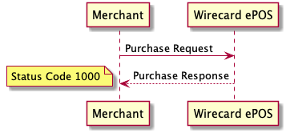
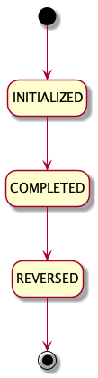

Cash is the most straightforward payment method to integrate.

!!! Tip

    Visit [Wirecard](https://www.wirecard.com/payment-base/pos) website to find out all benefits of Wirecard ePOS solution.

## Sequence Diagram

!!! Note
    
    Sale requests are serviced at following URL:
    
        https://switch.wirecard.com/mswitch-server/v1/sales

    In context of Wirecard ePOS, term `Purchase` is used for both:
    
    - type of Sale - called _Sale-Purchase_ - created by request with PURCHASE operation
    - transaction type - _Cash Purchase_ transaction, _Card Purchase_ transaction, _Alipay Purchase_ transaction and _WeChat Purchase_ transaction
    
## Purchase Operation

In order to process cash payment, make a [`POST /v1/sales`](https://switch.wirecard.com/mswitch-server/v1/sales) call:

### Request
    
    {
        "multitender": "true",
        "operation" : "PURCHASE",
        "totalAmount" : 10.0,
        "currencyCode" : "EUR",
        "payments" : [
            {
                "paymentMethod" : "CASH",
                "transactionType" : "PURCHASE",
                "amount" : 10.0
            }
        ]
    }

- `"multitender"` - boolean value
    - `"TRUE"` - required
    - `"FALSE"` - deprecated
- `"operation"` - defines type of operation; `"PURCHASE"` operation creates new Sale-Purchase record
- `"totalAmount"` - total amount of Sale-Purchase
- `"currencyCode"` - defines currency, based on [ISO 4217](https://en.wikipedia.org/wiki/ISO_4217) standard
- `"payments"` - includes payment-specific information
    - `"paymentMethod"` - defines payment method
    - `"transactionType"` - defines type of transaction; `"PURCHASE"` transaction moves funds from end-consumer to merchant
    - `"amount"` - defines transaction amount

### Response

    {
        "operation": "PURCHASE",
        "timeStamp": "2019-04-10T09:41:39.597Z",
        "status": {
            "code": "1000",
            "result": "SUCCESS"
        },
        "id": "bdb7dd5566f043ab9b91108863a6e833",
        "externalCashierId": null,
        "payments": [
            {
                "paymentMethod": "CASH",
                "transactionType": "PURCHASE",
                "id": "2d08be0814f04cc1a2b2b9b5cd1273e2",
                "timeStamp": "2019-04-10T09:41:39.554Z",
                "statuses": [
                    {
                        "result": "SUCCESS",
                        "code": "1000",
                        "message": "Transaction OK."
                    }
                ]
            }
        ],
        "externalId": null,
        "merchantReceiptId": 457,
        "multitender": true
    }
    
- `"operation"` - echoed from request
- `"timeStamp"` - date-time when response was constructed
- `"status"`
    - `"code"` - `"1000"` means operation is successful
    - `"result"` - `"SUCCESS"` means operation is successful
- `"id"` - Sale-Purchase identifier assigned by Wirecard ePOS system
- `"externalCashierId"` - relevant for [Advanced Integration](advanced-overview.md); otherwise null
- `"payments"` - includes payment-specific information
    - `"paymentMethod"` - echoed from request
    - `"transactionType"` - echoed from request
    - `"id"` - identifier of transaction assigned by Wirecard ePOS system
    - `"timeStamp"` - date-time when transaction was processed
    - `"statuses"`
        - `"result"` - `"SUCCESS"` means transaction is successful
        - `"code"` - `"1000"` means transaction is successful
        - `"message"` - message provided by payment gateway
- `"externalId"` - echoed from request
- `"merchantReceiptId"` - unique identifier for merchant; it is incremented with Sale-Purchase and Sale-Return; it is advised to be printed on receipt as a barcode
- `"multitender"` - echoed from request

!!! Important
    
    After successful response, making [`GET /v1/sales/{id}`](#get-a-sale-call) call is advised, as it provides all information.

## Reverse Operation

_REVERSE_ operation is typically used in case purchase transaction was created accidentally and hence needs to be reversed.

In order to reverse cash purchase transaction, make a [`POST /v1/sales`](https://switch.wirecard.com/mswitch-server/v1/sales) call:

### Request

    {
        "operation": "REVERSE",
        "originalSaleId": "bdb7dd5566f043ab9b91108863a6e833",
        "payments": [
            { 
                "paymentMethod": "CASH",
                "transactionType": "REVERSAL",
                "originalTransactionId" : "2d08be0814f04cc1a2b2b9b5cd1273e2"
            }
        ]
    }

- `"operation"` - defines type of operation
- `"originalSaleId"` - identifier of original Sale-Purchase
- `"payments"` - includes payment-specific information
    - `"paymentMethod"` - defines payment method; must be same as original payment method
    - `"transactionType"` - defines type of transaction; `"REVERSE"` operation must include `"REVERSAL"` transaction type
    - `"originalTransactionId"` - identifier of original purchase transaction

### Response

    {
        "operation": "REVERSE",
        "timeStamp": "2019-04-11T06:49:51.541Z",
        "status": {
            "code": "1000",
            "result": "SUCCESS"
        },
        "id": "bdb7dd5566f043ab9b91108863a6e833",
        "externalCashierId": null,
        "payments": [
            {
                "paymentMethod": "CASH",
                "transactionType": "REVERSAL",
                "id": "6f5789c304594fe8a796d5b2bdaebbf0",
                "timeStamp": "2019-04-11T06:49:51.532Z",
                "statuses": [
                    {
                        "result": "SUCCESS",
                        "code": "1000",
                        "message": "Transaction OK."
                    }
                ]
            }
        ]
    }

- `"operation"` - echoed from request
- `"timeStamp"` - date-time when response was constructed
- `"status"`
    - `"code"` - `"1000"` means operation is successful
    - `"result"` - `"SUCCESS"` means operation is successful
- `"id"` - echoed from request
- `"externalCashierId"` - relevant for [Advanced Integration](advanced-overview.md); otherwise null
- `"payments"` - includes payment-specific information
    - `"paymentMethod"` - echoed from request
    - `"transactionType"` - echoed from request
    - `"id"` - identifier of reversal transaction
    - `"timeStamp"` - date-time when reversal transaction was processed
    - `"statuses"`
        - `"result"` - `"SUCCESS"` means transaction is successful
        - `"code"` - `"1000"` means transaction is successful
        - `"message"` - message provided by payment gateway
        
In order to explicitly [change state of Sale-Purchase to CANCELED](multi-tender.md#what-is-sale-lifecycle-model), make a  `POST /v1/sales` call with [_CANCEL_ operation](multi-tender.md#what-is-cancel-operation).

## Return Operation

_RETURN_ operation is used in case end-consumer returns merchandise and asks for a refund. Wirecard ePOS support partial as well as full return.

In order to process cash refund transaction, make a [`POST /v1/sales`](https://switch.wirecard.com/mswitch-server/v1/sales) call defined below:

### Request

    {
        "operation" : "RETURN",
        "totalAmount" : 10,
        "currencyCode" : "EUR",
        "originalSaleId" : "344009e1f53a4dd0af9751f0b7d7d99d",
        "payments" : [
            {
                "paymentMethod" : "CASH",
                "transactionType" : "REFUND",
                "amount" : 10
            }
        ]
    }

- `"operation"` - defines type of operation; `"RETURN"` operation creates new Sale-Return record
- `"totalAmount"` - defines amount to be refunded; it can be equal (full return) or less (partial return) than totalAmount in original Sale-Purchase
- `"currencyCode"` - must be same as for original Sale-Purchase
- `"originalSaleId"` - identifier of original Sale-Purchase
- `"payments"` - includes payment-specific information
    - `"paymentMethod"` - defines payment method
    - `"transactionType"` - defines type of transaction; must be "`REFUND"` when payment method is `"CASH"`
    - `"amount"` - defines amount to be refunded

### Response

    {
        "operation": "RETURN",
        "timeStamp": "2019-04-11T09:55:15.594Z",
        "status": {
            "code": "1000",
            "result": "SUCCESS"
        },
        "id": "5c0e6ef0da784b8c940b488ef6f0cb8b",
        "externalCashierId": null,
        "payments": [
            {
                "paymentMethod": "CASH",
                "transactionType": "REFUND",
                "id": "2fec6d42713a4703a4422b1359c2b588",
                "timeStamp": "2019-04-11T09:55:15.575Z",
                "statuses": [
                    {
                        "result": "SUCCESS",
                        "code": "1000",
                        "message": "Transaction OK."
                    }
                ]
            }
        ],
        "externalId": "20190411001",
        "merchantReceiptId": 467
    }

- `"operation"` - echoed from request
- `"timeStamp"` - date-time when response was constructed
- `"status"`
    - `"code"` - `"1000"` means operation is successful
    - `"result"` - `"SUCCESS"` means operation is successful
- `"id"` - Sale-Return identifier assigned by Wirecard ePOS system
- `"externalCashierId"` - relevant for [Advanced Integration](advanced-overview.md); otherwise null
- `"payments"` - includes payment-specific information
    - `"paymentMethod"` - echoed from request
    - `"transactionType"` - echoed from request
    - `"id"` - identifier of refund transaction assigned by Wirecard ePOS system
    - `"timeStamp"` - date-time when transaction was processed
    - `"statuses"`
        - `"result"` - `"SUCCESS"` means transaction is successful
        - `"code"` - `"1000"` means transaction is successful
        - `"message"` - message provided by payment gateway
- `"externalId"` - echoed from request
- `"merchantReceiptId"` - unique identifier for merchant; it is incremented with every Sale-Purchase and Sale-Return; it is advised to be printed on receipt as a barcode

!!! Tip
    To see all `/v1/sales` request & response examples, [click here](https://switch-test.wirecard.com/mswitch-server/doc/api-doc-sale-examples.html).
    
## Get a Sale call

Example of `GET /v1/sales/{id}` call with excluded _merchant_ and _user_ fields (described in [Merchant Details](merchant.md) and [User Management](user.md) respectively):
    
    GET https://switch-test.wirecard.com/mswitch-server/v1/sales/19267cf3a3cb4e2d8131917b5c092a0d?excludeField=merchant&excludeField=user
    
    {
          "id": "19267cf3a3cb4e2d8131917b5c092a0d",
          "type": "PURCHASE",
          "status": "COMPLETED",
          "totalAmount": 10,
          "note": null,
          "externalId": null,
          "externalCashierId": null,
          "customerId": null,
          "initialized": "2019-04-11T13:36:11.521Z",
          "shop": null,
          "currency": {
                "number": 978,
                "code": "EUR",
                "name": "Euro",
                "minorUnit": 2
          },
          "unitPricesIncludeTax": null,
          "items": [
          ],
          "transactions": [
                {
                      "type": "CASH_PURCHASE",
                      "id": "7a8f701dd40743e0ad942ae32cd0e9d8",
                      "status": "COMPLETED",
                      "amount": 10,
                      "lastUpdated": "2019-04-11T13:36:11.597Z",
                      "initialized": "2019-04-11T13:36:11.521Z",
                      "message": null
                }
          ],
          "location": null,
          "clientInfo": null,
          "merchantReceiptId": 245,
          "cancelledBy": null,
          "shiftId": null,
          "cashRegisterId": null,
          "emailForReceipt": null,
          "emailForReceiptProvided": false,
          "multitender": true
    }

## Purchase Transaction Lifecycle

