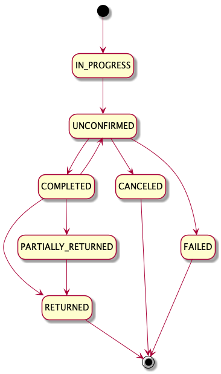

Wirecard ePOS solution provides an option to divide Sale total amount to multiple payment transactions.

!!! Example
    
    Jeans in value of 100 € are paid by two payment transactions: 60 € is paid by _card_ and 40 € is paid in _cash_.
    
!!! Note
    
    In payment industry domain terms _multi-tender_, _multi-payment_ and _split-payment_ can be considered as synonyms.

## Why Wirecard ePOS provides multi-tender?
    
Merchant is able to increase its revenue as the likelihood to reach more end-consumers is increasing with more payment options provided.

End-consumers may want to combine multiple debit and/or credit cards, especially in case of purchase in value of several thousand euros which exceeds limits on their cards.

## How to integrate multi-tender?

As long as you send `"multitender"` field set to `"true"`, you are integrated.

!!! Warning

    It is strongly advised to send `"multitender": "true"` in all requests with `"operation" : "PURCHASE"`. Otherwise you are not compliant with the latest [Sale lifecycle model](#what-is-sale-lifecycle-model), which is described in this guide.

## How to divide total amount into multiple payments?

Let's see real-live example below.

!!! Example

    Purchase of merchandise in value of 1000 EUR is paid by combining two payment methods, Alipay and cash.

    **1. step -  Purchase operation:**
    
    Request includes mandatory fields for `"PURCHASE"` operation.
    However, in this case, total amount is 1000 and Alipay purchase transaction amount is 700.
    
        POST https://switch.wirecard.com/mswitch-server/v1/sales
        
        {
            "multitender": "true",
            "operation" : "PURCHASE",
            "totalAmount" : 1000,
            "currencyCode" : "EUR",
            "payments" : [
                {
                    "paymentMethod" : "ALIPAY",
                    "transactionType" : "PURCHASE",
                    "amount" : 700,
                    "consumerId" : "28050011747660761"
                }
            ]
        }
    
    **2. step - Reference Purchase operation:**
    
    Reference Purchase operation includes only reference to original Sale-Purchase and payment-specific information. In this case, cash purchase transaction covers all unpaid amount, exactly 300.
    
        POST https://switch.wirecard.com/mswitch-server/v1/sales
        
        {
            "operation" : "REFERENCE_PURCHASE",
            "originalSaleId": "5d01cf38548f4007962e7d68004fcc76",
            "payments" : [
                {
                    "paymentMethod" : "CASH",
                    "transactionType" : "PURCHASE",
                    "amount" : 300
                }
            ]
        }
    
## What is Sale lifecycle model?

Every _PURCHASE_ operation, which passes validation, creates new Sale-Purchase record in Wirecard ePOS system. Sale-Purchase record gets one of the following states:

- **IN_PROGRESS** - internal state
- **UNCONFIRMED** - purchase transaction is processed and Sale total amount is not fully paid
- **COMPLETED** - sum of completed purchase transactions cover Sale total amount
- **RETURNED** - all purchased goods have been returned by customer and Sale total amount is refunded
- **PARTIALLY_RETURNED** - only some of purchased goods have been returned by customer and part of the Sale total amount is refunded
- **CANCELED** - all purchase transactions are reversed and [CANCEL](#what-is-cancel-operation) operation was successful
- **FAILED** - all purchase transaction are either in FAILED or REVERSED state and [FAIL](#what-is-fail-operation) operation was successful

!!! Tip
    Use [GET /v1/sales/{id} call](cash.md#get-a-sale-call) to get Sale record with all details.
    
## What is Cancel operation?

_CANCEL_ operation is used to change Sale-Purchase from UNCONFIRMED state to CANCELED state. _CANCEL_ operation is accepted by system as long as all purchase transactions are in REVERSED state.

In order to move Sale-Purchase to CANCELED state, make a `POST /v1/sales` call:

### Request

    {
        "operation": "CANCEL",
        "originalSaleId": "bdb7dd5566f043ab9b91108863a6e833"
    }
    
- `"operation"` - defines type of Sale request
- `"originalSaleId"` - identifier of original Sale-Purchase

### Response

    {
        "operation": "CANCEL",
        "timeStamp": "2019-04-11T13:30:05.187Z",
        "status": {
            "code": "1000",
            "result": "SUCCESS"
        },
        "id": "bdb7dd5566f043ab9b91108863a6e833",
        "externalCashierId": null
    }
    
- `"operation"` - echoed from request
- `"timeStamp"` - date-time when response was constructed
- `"status"`
    - `"code"` - `"1000"` means operation is successful
    - `"result"` - `"SUCCESS"` means operation is successful
- `"id"` - echoed from request; Sale-Purchase identifier
- `"externalCashierId"` - relevant for [Advanced Integration](advanced-overview.md); otherwise null

## What is Fail operation?

_FAIL_ operation is used to change Sale-Purchase from UNCONFIRMED state to FAILED state. _FAIL_ operation is accepted by system as long as all purchase transactions are in FAILED or REVERSED state.

In order to move Sale-Purchase to FAILED state, make a `POST /v1/sales` call:

### Request

    {
        "operation" : "FAIL",
        "originalSaleId" : "56d72f5fa5454f3e9fc8364078f74fce"
    }

- `"operation"` - defines type of Sale request
- `"originalSaleId"` - identifier of original Sale-Purchase

### Response

    {
        "operation": "FAIL",
        "timeStamp": "2019-05-22T12:07:24.857Z",
        "status": {
            "code": "1000",
            "result": "SUCCESS"
        },
        "id": "56d72f5fa5454f3e9fc8364078f74fce",
        "externalCashierId": null
    }

- `"operation"` - echoed from request
- `"timeStamp"` - date-time when response was constructed
- `"status"`
    - `"code"` - `"1000"` means operation is successful
    - `"result"` - `"SUCCESS"` means operation is successful
- `"id"` - echoed from request; Sale-Purchase identifier
- `"externalCashierId"` - relevant for [Advanced Integration](advanced-overview.md); otherwise null