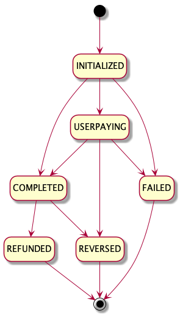

WeChat Pay is one of China‘s leading payment methods. Since its start as a chat app, WeChat has grown to become a market-leading platform by connecting people, services, and businesses in China and around the world.

!!! Tip
    
    Visit [Wirecard website](https://www.wirecard.com/payment-base/wechat-pay) to find out all benefits of WeChat payment.

From merchant perspective, WeChat can be either [one-step](#1-step-wechat-payment) or [two-step](#2-step-wechat-payment) payment:

- In case end-consumer (buyer) is not prompted to authorize payment on his device then all is needed is [one request](#purchase-operation).

- In case end-consumer (buyer) is prompted to authorize payment with password or other equivalent (pin code, fingerprint, etc.) then merchant has to query Wirecard ePOS system in order to get the final status of WeChat transaction. Technically-wise, it means that initial [request](#purchase-operation) (_PURCHASE_) has to be followed by [query request](#confirm-operation) (_CONFIRM_).
    
## Workflow

### 1-step WeChat payment

### 2-step WeChat payment

!!! Note
    
    Purchase requests are serviced at following URL:
    
        https://switch.wirecard.com/mswitch-server/v1/sales

    In context of Wirecard ePOS, term **Purchase** is used for both:
    
    - type of Sale - called _Sale-Purchase_ - created by request with PURCHASE operation
    - transaction type - _cash purchase_ transaction, _card purchase_ transaction, _alipay purchase_ transaction and _wechat purchase_ transaction
    
## Purchase Operation

In order to process WeChat payment, make a [`POST /v1/sales`](https://switch.wirecard.com/mswitch-server/v1/sales) call:

### Request

    {
        "multitender": "true",
        "operation" : "PURCHASE",
        "note" : "Example Note",
        "externalId": "123456789",
        "totalAmount" : 10,
        "currencyCode" : "EUR",
        "payments" : [
            {
                "paymentMethod" : "WECHAT",
                "transactionType" : "PURCHASE",
                "amount" : 10,
                "consumerId" : "15050011719660761"
            }
        ]
    }
    
- `"multitender"` - boolean flag
    - `"TRUE"` - required
    - `"FALSE"` - deprecated
- `"operation"` - defines type of Sale request; `"PURCHASE"` operation creates Sale-Purchase record
- `"note"` - _optional field_ - used for merchant tracking purposes; it is forwarded to payment gateway in `<order-detail>` field
- `"externalId"` - _optional field_ - used for merchant tracking purposes; it is forwarded to payment gateway in `<order-number>` field
- `"totalAmount"` - defines amount of Sale-Purchase 
- `"currencyCode"` - defines currency, based on [ISO 4217](https://en.wikipedia.org/wiki/ISO_4217) standard
- `"payments"` - includes payment-specific information
    - `"paymentMethod"` - defines payment method
    - `"transactionType"` - defines type of transaction; `"PURCHASE"` transaction moves funds from end-consumer to merchant
    - `"amount"` - defines transaction amount
    - `"consumerId"` - value of scanned barcode (QR code)

### Response indicating 1-step WeChat payment

In order to identify whether the follow-up _CONFIRM_ operation is required, status code has to be interpreted.

**Status Code 1000 indicates** that WeChat purchase transactions is completed and **no follow-up request is required**.

    {
        "operation": "PURCHASE",
        "timeStamp": "2019-05-07T12:12:38.177Z",
        "status": {
            "code": "1000",
            "result": "SUCCESS"
        },
        "id": "241e578a773a4d869408f43928ddf1fd",
        "externalCashierId": null,
        "payments": [
            {
                "paymentMethod": "WECHAT",
                "transactionType": "PURCHASE",
                "id": "776af8e4a4d843129149bdf8b73c08b9",
                "timeStamp": "2019-05-07T12:12:32.9Z",
                "statuses": [
                    {
                        "result": "SUCCESS",
                        "code": "1000",
                        "message": "Transaction OK."
                    }
                ],
                "wechatProviderTransactionId": "f75ab0866f55477cb35a2db5db6bb10d",
                "wechatRate": "691870000",
                "wechatSubMchId": "444917",
                "wechatCashFee": "6919",
                "wechatTimeEnd": "20190507201238",
                "gatewayReference": "573ee979-a265-49b9-b020-27418dbb63ef"
            }
        ],
        "externalId": null,
        "merchantReceiptId": 262,
        "multitender": true
    }

- `"operation"` - echoed from request
- `"timeStamp"` - date-time when response was constructed
- `"status"`
    - `"code"` - `"1000"` means operation is completed successfully
    - `"result"` - `"SUCCESS"` means operation is completed successfully
- `"id"` - Sale-Purchase identifier assigned by Wirecard ePOS system
- `"externalCashierId"` - relevant for [Advanced Integration](advanced_overview.md); otherwise null
- `"payments"` - specific information for every payment method
    - `"paymentMethod"` - echoed from request
    - `"transactionType"` - echoed from request
    - `"id"` - identifier of purchase transaction assigned by Wirecard ePOS system
    - `"timeStamp"` - date-time when transaction was processed by payment gateway
    - `"statuses"`
        - `"result"` - `"SUCCESS"` means transaction is completed successfully
        - `"code"` - `"1000"` means transaction is completed successfully
        - `"message"` - message provided by payment gateway
    - `"wechatProviderTransactionId"` - transaction identifier in WeChat System
    - `"wechatRate"` - exchange rate between Sale currency and CNY in WeChat System; 691870000 means 6.918
    - `"wechatSubMchId"` - merchant identifier in WeChat System
    - `"wechatCashFee"` - amount in CNY (Chinese Yuan); 6919 means 69.19 CNY
    - `"wechatTimeEnd"` - date-time in WeChat system
    - `"gatewayReference"` - transaction identifier in Wirecard payment gateway
- `"externalId"` - echoed from request
- `"merchantReceiptId"` - unique identifier per merchant; it is incremented with every Sale-Purchase and Sale-Return; advised to be printed on receipt as a barcode
- `"multitender"` - echoed from request

!!! Important
    
    After successful response, making [`GET /v1/sales/{id}`](#get-a-sale-call) call is advised, as it provides all information.

### Response indicating 2-step WeChat payment

In order to identify whether the follow-up _CONFIRM_ operation is required, status code has to be interpreted.

**Status Code 1001 indicates** that WeChat purchase transactions is not completed and **follow-up _CONFIRM_ request is required**.

    {
        "operation": "PURCHASE",
        "timeStamp": "2019-05-07T12:01:24.703Z",
        "status": {
            "code": "1001",
            "result": "SUCCESS"
        },
        "id": "3c9cf14fe82f42bfbecb6dec22edbfe3",
        "externalCashierId": null,
        "payments": [
            {
                "paymentMethod": "WECHAT",
                "transactionType": "PURCHASE",
                "id": "9685e8c3620a4c6b8e98518c7b2427d4",
                "timeStamp": "2019-05-07T12:01:24.614Z",
                "statuses": [
                    {
                        "result": "SUCCESS",
                        "code": "1001",
                        "message": "Transaction OK."
                    }
                ],
                "wechatSubMchId": "693876",
                "gatewayReference": "c7d76bcf-595d-4318-a9b9-38ac9ac1d53a"
            }
        ],
        "externalId": null,
        "merchantReceiptId": 261,
        "multitender": true
    }
    
- `"operation"` - echoed from request
- `"timeStamp"` - date-time when response was constructed
- `"status"`
    - `"code"` - `"1001"` means operation is successful, however follow-up `"CONFIRM"` request is required to complete WeChat purchase transaction
    - `"result"` - `"SUCCESS"` means operation is successful
- `"id"` - Sale-Purchase identifier assigned by Wirecard ePOS system
- `"externalCashierId"` - relevant for [Advanced Integration](advanced_overview.md); otherwise null
- `"payments"` - specific information for every payment method
    - `"paymentMethod"` - echoed from request
    - `"transactionType"` - echoed from request
    - `"id"` - identifier of purchase transaction assigned by Wirecard ePOS system
    - `"timeStamp"` - date-time when transaction was processed by payment gateway
    - `"statuses"`
        - `"result"` - `"SUCCESS"` means transaction is successful
        - `"code"` - `"1001"` means transaction is successful
        - `"message"` - message provided by payment gateway
    - `"wechatSubMchId"` - merchant identifier in WeChat System
    - `"gatewayReference"` - transaction identifier in Wirecard payment gateway
- `"externalId"` - echoed from request
- `"merchantReceiptId"` - unique identifier per merchant; it is incremented with every Sale-Purchase and Sale-Return; advised to be printed on receipt as a barcode
- `"multitender"` - echoed from request

## Confirm Operation

### Request
    
    {
        "operation" : "CONFIRM",
        "originalSaleId" : "3c9cf14fe82f42bfbecb6dec22edbfe3",
        "payments" : [
            {
                "paymentMethod" : "WECHAT",
                "transactionType" : "CONFIRM"
            }
        ]
    }
    
- `"operation"` - defines type of Sale request; `"CONFIRM"` operation does finish the WeChat Purchase transaction
- `"originalSaleId"` - identifier of original Sale-Purchase
- `"payments"` - includes payment-specific information
    - `"paymentMethod"` - defines payment method; it must be same as original payment transaction
    - `"transactionType"` - defines type of transaction; `"CONFIRM"` operation must include `"CONFIRM"` transaction type
    
### Response

**Status Code 1000** indicates that WeChat purchase transaction is completed successfully.

    {
        "operation": "CONFIRM",
        "timeStamp": "2019-05-07T12:02:24.739Z",
        "status": {
            "code": "1000",
            "result": "SUCCESS"
        },
        "id": "3c9cf14fe82f42bfbecb6dec22edbfe3",
        "externalCashierId": null,
        "payments": [
            {
                "paymentMethod": "WECHAT",
                "transactionType": "CONFIRM",
                "id": "9685e8c3620a4c6b8e98518c7b2427d4",
                "timeStamp": "2019-05-07T12:02:24.641Z",
                "statuses": [
                    {
                        "result": "SUCCESS",
                        "code": "1000",
                        "message": "Transaction OK."
                    }
                ],
                "wechatProviderTransactionId": "dced92fe6e5042a8856bf8e3dc7c15f8",
                "wechatRate": "691870000",
                "wechatSubMchId": "839907",
                "wechatCashFee": "6919",
                "wechatTimeEnd": "20190507200224",
                "gatewayReference": "ae0d14df-7528-4e5e-b2d6-4393b8c767d9"
            }
        ]
    }
    
- `"operation"` - echoed from request
- `"timeStamp"` - date-time when response was constructed
- `"status"`
    - `"code"` - `"1000"` means operation is successful
    - `"result"` - `"SUCCESS"` means operation is successful
- `"id"` - Sale-Purchase identifier assigned by Wirecard ePOS system
- `"externalCashierId"` - relevant for [Advanced Integration](advanced_overview.md); otherwise null
- `"payments"` - specific information for every payment method
    - `"paymentMethod"` - echoed from request
    - `"transactionType"` - echoed from request
    - `"id"` - identifier of purchase transaction assigned by Wirecard ePOS system
    - `"timeStamp"` - date-time when transaction was processed by payment gateway
    - `"statuses"`
        - `"result"` - `"SUCCESS"` means transaction is successful
        - `"code"` - `"1000"` means transaction is successful
        - `"message"` - message provided by payment gateway
    - `"wechatProviderTransactionId"` - transaction identifier in WeChat System
    - `"wechatRate"` - exchange rate between Sale currency and CNY in WeChat System; 691870000 means 6.918
    - `"wechatSubMchId"` - merchant identifier in WeChat System
    - `"wechatCashFee"` - amount in CNY (Chinese Yuan); 6919 means 69.19 CNY
    - `"wechatTimeEnd"` - date-time in WeChat system
    - `"gatewayReference"` - transaction identifier in Wirecard payment gateway
    
!!! Important
    
    After successful response, making [`GET /v1/sales/{id}`](#get-a-sale-call) call is advised, as it provides all information.

## Reverse Operation

_REVERSE_ operation is typically used in case purchase transaction was created accidentally and hence needs to be reversed.

In order to reverse WeChat purchase transaction, make a [`POST /v1/sales`](https://switch.wirecard.com/mswitch-server/v1/sales) call:

### Reverse Request

    {
        "operation": "REVERSE",
        "originalSaleId": "a0a09836df08426b92d4805294bdae42",
        "payments": [
            { 
                "paymentMethod": "WECHAT",
                "transactionType": "REVERSAL",
                "originalTransactionId" : "809364e83e3043c7a15182140d55268e"
            }
        ]
    }

- `"operation"` - defines type of Sale request
- `"originalSaleId"` - identifier of original Sale-Purchase
- `"payments"` - includes payment-specific information
    - `"paymentMethod"` - defines payment method; it must be same as original payment transaction
    - `"transactionType"` - defines type of this transaction; `"REVERSE"` operation must include `"REVERSAL"` transaction type
    - `"originalTransactionId"` - identifier of original purchase transaction
    
### Reverse Response

    {
        "operation": "REVERSE",
        "timeStamp": "2019-05-16T13:08:24.657Z",
        "status": {
            "code": "1000",
            "result": "SUCCESS"
        },
        "id": "a0a09836df08426b92d4805294bdae42",
        "externalCashierId": null,
        "payments": [
            {
                "paymentMethod": "WECHAT",
                "transactionType": "REVERSAL",
                "id": "c254b80758574ce387d3852e1d69c3ec",
                "timeStamp": "2019-05-16T13:08:24.553Z",
                "statuses": [
                    {
                        "result": "SUCCESS",
                        "code": "1000",
                        "message": "Transaction OK."
                    }
                ],
                "wechatProviderTransactionId": "adfc24a6c25343ce86f5cb180a5cc528",
                "wechatRate": "691870000",
                "wechatSubMchId": "067227",
                "wechatDeviceInfo": "dell",
                "wechatCashFee": "6919.00",
                "wechatTimeEnd": "20190516210824",
                "gatewayReference": "8ba7937e-ea22-4b9f-855a-dce11e4a29b7"
            }
        ]
    }

In order to explicitly [change state of Sale-Purchase to CANCELED](multi-tender.md#what-is-sale-lifecycle-model), make a  `POST /v1/sales` call with [_CANCEL_ operation](multi-tender.md#what-is-cancel-operation).
    
## Return Operation

_RETURN_ operation is used in case end-consumer returns merchandise and asks for a refund. Wirecard ePOS support partial as well as full return.

In order to process WeChat refund transaction, make a [`POST /v1/sales`](https://switch.wirecard.com/mswitch-server/v1/sales) call defined below:

### Request

    {
        "operation" : "RETURN",
        "totalAmount" : 10,
        "currencyCode" : "EUR",
        "originalSaleId" : "1025a74c86564982988f66a46489d87a",
        "payments" : [ 
            {
                "paymentMethod" : "WECHAT",
                "transactionType" : "REFERENCE_REFUND",
                "amount" : 10,
                "originalTransactionId" : "f4c16e2ee76d44d2adfc42b97ac3e5a0"
            }
        ]
    }

### Response

    {
        "operation": "RETURN",
        "timeStamp": "2019-05-17T10:40:48.648Z",
        "status": {
            "code": "1000",
            "result": "SUCCESS"
        },
        "id": "ba313afaf21e445abc802ab63bb69c5a",
        "externalCashierId": null,
        "payments": [
            {
                "paymentMethod": "WECHAT",
                "transactionType": "REFERENCE_REFUND",
                "id": "1baf69229f584858ad524585db27115a",
                "timeStamp": "2019-05-17T10:40:48.533Z",
                "statuses": [
                    {
                        "result": "SUCCESS",
                        "code": "1000",
                        "message": "Transaction OK."
                    }
                ],
                "wechatProviderTransactionId": "f5fd9c49306a4322a9e613d741c71de3",
                "wechatRate": "691870000",
                "wechatSubMchId": "785721",
                "wechatDeviceInfo": "dell",
                "wechatCashFee": "6919.00",
                "wechatTimeEnd": "20190517184048",
                "gatewayReference": "4fb9f8a2-7fb9-4fd7-a88c-154f58fb7ab8"
            }
        ],
        "externalId": null,
        "merchantReceiptId": 270
    }

!!! Tip
    To see all `/v1/sales` request & response examples, [click here](https://switch-test.wirecard.com/mswitch-server/doc/api-doc-sale-examples.html).
    
## Get a Sale Call

Example of `GET /v1/sales/{id}` call with excluded _merchant_ and _user_ fields (described in [Merchant Management](merchant-management.md) and [User Management](user.md) respectively):
    
    GET https://switch-test.wirecard.com/mswitch-server/v1/sales/3c9cf14fe82f42bfbecb6dec22edbfe3?excludeField=merchant&excludeField=user
    
    {
        "id": "3c9cf14fe82f42bfbecb6dec22edbfe3",
        "type": "PURCHASE",
        "status": "COMPLETED",
        "totalAmount": 10,
        "note": null,
        "externalId": null,
        "externalCashierId": null,
        "customerId": null,
        "initialized": "2019-05-07T12:01:24.44Z",
        "shop": null,
        "currency": {
            "number": 978,
            "code": "EUR",
            "name": "Euro",
            "minorUnit": 2
        },
        "unitPricesIncludeTax": null,
        "items": [
        ],
        "transactions": [
            {
                "type": "WECHAT_PURCHASE",
                "id": "9685e8c3620a4c6b8e98518c7b2427d4",
                "status": "COMPLETED",
                "amount": 10,
                "lastUpdated": "2019-05-07T12:02:24.668Z",
                "initialized": "2019-05-07T12:01:24.442Z",
                "message": "The resource was successfully created on WeChat side.\nWas: The resource was successfully created on WeChat side, but password confirmation is needed.",
                "gateway": {
                    "id": "wdEeSimulated",
                    "name": "Wirecard EE Simulated",
                    "type": "WIRECARD_EE_SIMULATED",
                    "url": "http://dummy"
                },
                "gatewayReference": "c7d76bcf-595d-4318-a9b9-38ac9ac1d53a",
                "processedByGateway": "2019-05-07T12:01:24.614Z",
                "wechatProviderTransactionId": "dced92fe6e5042a8856bf8e3dc7c15f8",
                "wechatRate": "691870000",
                "wechatSubMchId": "839907",
                "wechatDeviceInfo": "dell",
                "wechatCashFee": "6919.00",
                "wechatTimeEnd": "20190507200224",
                "autoResolveTransactions": [
            
            ],
                "transactionBarcodeId": "15050011719660761"
            }
        ],
        "location": null,
        "clientInfo": null,
        "merchantReceiptId": 261,
        "cancelledBy": null,
        "shiftId": null,
        "cashRegisterId": null,
        "emailForReceipt": null,
        "emailForReceiptProvided": false,
        "multitender": true
    }
    
## Purchase Transaction Lifecycle

